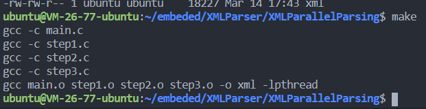

## **<center><font size=6>嵌入式软件开发技术与工具实验报告</font></center>**

<center><font>刘一丁 黎炜桁 冉然</font></center>

---

### **一、实验目的**

- 在建立交叉编译开发平台之前，首先需要建立主机(虚拟机/PC，或双系统）开发环境；
- 学会使用本地gcc编译应用程序；
- 学会使用Makefile管理应用程序；
- 学会通过autotools生成Makefile，学会常用的make操作；
- 学会通过git/github管理团队软件和工作文件。

### **二、实验内容**

- 安装主机(虚拟机/PC)Linux开发环境，Fedora，Ubuntu，Debian均可；
- 编写c应用程序，通过本地gcc编译应用程序，如果是基于x86的主机，gcc输出的执行文件运行的是x86指令集；
- 编写Makefile管理应用程序，为更好体现Makefile的作用，需编写多个c程序，给出所创建的Makefile的内容；
- 通过autotools生成Makefile，完成常用的make操作(make,make install, make uninstall, make dist)；
- 创建小组git仓库，github账号，用来存储小组工作文件以及小组报告；学习如何构建github文件，如何上传和下载github文件等。
  
### **三、实验过程与结果**

**1. 安装Linux开发环境**  

   采用双系统的方式安装Ubuntu-16.04 LTS系统。

**2. GCC编译应用程序**  

   创建一个C语言程序，使用GCC进行编译并运行。C源程序代码如下：

```C
    #include <stdio.h>

    int main(){
        printf("hello world!");
        return 0;
    }
```

   使用GCC编译程序`gcc hello.c -o hello`，并运行程序，结果如下：
   

**3. Makefile管理应用程序**

   本实验采用已有的XML并行解析程序，共建立四个C源程序文件main.c,step1.c,step2.c,step3.c,一个头文件myXml.h，使用Makefile进行管理和编译。Makefile代码如下：

   ```Makefile
        objects = main.o step1.o step2.o step3.o
        cc = gcc
        hdrs = myXml.h

        xml : main.o step1.o step2.o step3.o
            gcc main.o step1.o step2.o step3.o -o xml -lpthread
        main.o  : main.c $(hdrs)
            $(cc) -c main.c
        step1.o : step1.c $(hdrs)
            $(cc) -c step1.c
        step2.o : step2.c $(hdrs)
            $(cc) -c step2.c
        step3.o : step3.c $(hdrs)
            $(cc) -c step3.c

        .PHONY : clean
        clean :
            -rm -f $(objects)
   ```

   执行make命令，编译整个程序

   
   
   执行程序，程序成功运行，编译成功

   

**4. 通过autotools生成Makefile**

   (1) 运行autoscan，生成configure.scan文件  

   

   (2)修改configure.scan，设置程序名称、版本等信息，关联头文件和相关库，并修改为configure.ac  

   

   (3)使用aclocal命令扫描configure.ac文件生成 aclocal.m4文件, 获取autoconf创建configure所需的宏定义  

   

   (4)使用autoconf命令读取configure.ac文件中的宏，生成configure脚本  

   

   (5)使用autoheader命令生成config.h.in文件
   

   (6)创建Makefile.am文件，由于该程序使用了多线程技术，因此需要在模板的基础上加入  `xml_LDADD=-lpthread`引用多线程库，文件内容如下  

   

   (7)使用automake命令生成Makefile.in文件。--add-missing 选项可以让 automake自动添加必需的模板文件  

   

   (8)生成成功后，运行./configure，生成Makefile  

   

   (9)运行make，并运行生成的程序，观察编译结果  

   

   程序运行成功  

   
   
   (10)运行make install指令，安装程序，注意需要sudo，否则权限不够无法拷贝文件到系统目录  

     

   后退到embeded目录，运行程序，程序运行成功  

   

   (11)运行make dist指令，打包程序，在目录下形成`xml-1.0.tar.gz`文件  

   

**5. 创建小组git仓库并上传文件**  

   创建的github仓库地址为[https://github.com/Embedded-software-developemnt-tools/liweiheng]("https://github.com/Embedded-software-developemnt-tools/liweiheng")  

   首先克隆到本地，在git命令行输入`git clone https://github.com/Embedded-software-developemnt-tools/liweiheng.git`  
   
   

   将实验报告复制到目录下，使用`git add .`提交到暂存区  

   

   `git commit -m "嵌入式软件开发技术与工具实验报告 PDF"`提交到本地版本库并添加说明  

   

   `git push origin master`提交到云端版本库，完成文件上传  

   

   网页端可观察到文件上传成功  

   

### **四、实验总结**  

本次实验我在笔记本上安装了Ubuntu双系统，并实践了Makefile的使用和编写，利用automake工具自动生成Makefile，最终将文件上传至小组github仓库中。实验过程中也遇到了很多的问题，例如automake工具安装后报错，automake过程中由于示例程序使用了不同的库和头文件导致的Makefile生成失败等问题，在查阅各种资料后最终解决。在实验的过程中我熟练掌握了Makefile的各种用法以及github的用法，受益匪浅。
