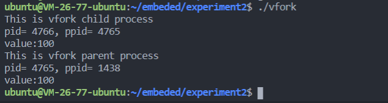
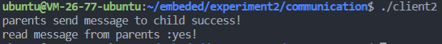

# **<center><font size=6>嵌入式软件开发技术与工具实验报告二</font></center>**

<center><font>刘一丁 黎炜桁 冉然</font></center>

---

### **一、实验目的**  

- 学会创建多进程程序，理解fork()，vfork() 创建的子进程的特点。  
- 学会使用有名管道和无名管道实现进程间通信。  
- 学会使用信号机制实现进程间通信。  

### **二、实验内容**  

1. 编写fork()，vfork()多进程程序，通过输出结果比较所创建的子进程的不同之处。  
2. 编写fork()多进程程序，进程间模拟信号通信，包括信号发送、捕捉与处理。  
3. 编写fork()多进程程序，进程间实现有名管道和无名管道通信。具体要求如下：  
   - 编写1个服务器程序server.c和2个客户端程序client1.c,client2.c ，服务器和客户端之间采用FIFO管道通信；  
   - 服务器和客户端各自创建自己的子进程，父进程负责完成FIFO管道通信，子进程负责输出接收到的信息，父子进程间采用无名管道通信。 

### **三、实验过程与结果**  

#### 1. 编写fork(), vfork()多进程程序，比较创建子进程的不同之处  

 - fork.c   
使用fork()创建子进程，在子进程中，value值加100，父进程中value值不变，通过输出value值判断使用fork()创建进程对变量的影响   


- vfork.c  
采用与fork.c相同的操作，进行比较   



- 结论  
采用fork()创建的子进程会拷贝父进程的内容，拥有独立地址空间，子进程与父进程的执行顺序不确定。采用vfork()创建的子进程将与父进程共享内存，并首先运行子进程，然后再运行父进程。  

#### 2. 编写fork()多进程程序，模拟信号通信    

自定义handler函数，从父进程使用kill函数向子进程发送信号，子进程调用handler处理信号  

- signal.c  

```C
#include <stdio.h>
#include <stdlib.h>
#include <signal.h>
#include <unistd.h>

void handler(int signum){
    if(signum == SIGINT) printf("capture SIGINT\n");
    if(signum == SIGSTOP) printf("capture SIGSTOP\n");
}

int main(){
    pid_t pid;
    int flag;
    pid = fork();
    if(pid < 0){
        perror("fork error");
        exit(1);
    }
    else if(pid == 0){
        printf("child process pid=%d\n", getpid());
        signal(SIGINT, handler);
        signal(SIGSTOP, handler);
        exit(EXIT_SUCCESS);
    }else{
        printf("parent process pid=%d\n", getpid());
        kill(pid+1, SIGint);
        
        printf("parent send SIGINT\n");
        
        kill(pid+1, SIGSTOP);
        
        printf("parent send SIGSTOP\n");
        
        exit(EXIT_SUCCESS);
    }
}
```
运行程序可观察到，信号被捕捉并处理  


#### 3. 编写fork()多进程程序，实现有名管道和无名管道通信    

本程序采用server通过fifo有名管道向client1、client2发送信息，client1、client2分别使用fork()创建子进程，父进程接收fifo管道信息，通过无名管道pipe传递给子进程并打印输出。  

- Makefile

```makefile
.PHONY :all
all:client1 client2 server

client1: client1.c
	gcc -o $@ $^ 
client2: client2.c
	gcc -o $@ $^ 
server: server.c
	gcc -o $@ $^ 

.PHONE :clean
clean :
	rm -f client1 client2 server client1pipe client2pipe
```

- server.c
以只写的方式开辟两条有名管道，分别对应client1、client2，并依次向client1、client2发送信息。  

```c
#include <stdio.h>
#include <sys/types.h>
#include <sys/stat.h>
#include <fcntl.h>
#include <unistd.h>
#include <stdlib.h>
#include <errno.h>
#include <string.h>

int main()
{
    umask(0); //允许进程创建文件时有最大权限
    if(mkfifo("client1pipe",0644)<0)    //创建命名管道
    {
        perror("mkfifo");            //创建失败
        exit(1);
    }
    if(mkfifo("client2pipe",0644)<0)    //创建命名管道
    {
        perror("mkfifo");            //创建失败
        exit(1);
    }

    int client1fd,client2fd;

    char buf[100];
    memset(buf,0,100);

    client1fd = open("client1pipe",O_WRONLY,0);//向cilent1发送信息
    printf("Server input a message to client1: ");
    gets(buf);
    write(client1fd,buf,strlen(buf));


    client2fd = open("client2pipe",O_WRONLY,0);//向client2发送信息
    printf("Server input a message to client2: ");
    gets(buf);
    write(client2fd,buf,strlen(buf));
    
    return 0;
}
```  


- client1.c  

使用fork()创建子进程，pipe创建无名管道，父进程接收信息，通过无名管道传递到子进程打印输出。  
```c
 #include<stdio.h>
 #include<stdlib.h>
 #include<unistd.h>
 #include<string.h>
 #include<sys/stat.h>
 #include<fcntl.h>
 #include<sys/types.h>

int main()
{

    int readfd,writefd;
    pid_t   pid;
    char buf[100];
    memset(buf,0,100);
    int pfd[2];
    
    if(pipe(pfd) < 0){
        perror("pipe error");
        exit(1);
    }

    if((pid = fork()) == -1){
        perror("fork error");
        exit(EXIT_FAILURE);
    }else if(pid == 0){
        close(pfd[1]);
        sleep(1);
        read(pfd[0],buf,100);
        printf("read message from parents :%s\n", buf);
        close(pfd[0]);
        exit(0);
    }else{
        
        readfd = open("client1pipe",O_RDONLY,0);
        read(readfd,buf,100);
        close(readfd);

        unlink("client1pipe");
        close(pfd[0]);
        write(pfd[1],buf,strlen(buf));
        printf("parents send message to child success!\n");

        close(pfd[1]);
        waitpid(pid,NULL,0);
        exit(0);

    }

}
```

- client2.c
使用fork()创建子进程，pipe创建无名管道，父进程接收信息，通过无名管道传递到子进程打印输出。  

```c
 #include <stdio.h>
 #include <stdlib.h>
 #include <unistd.h>
 #include <string.h>
 #include <sys/stat.h>
 #include <fcntl.h>
 #include <sys/types.h>

int main()
{

    int readfd,writefd;
    pid_t   pid;
    char buf[100];
    memset(buf,0,100);
    int pfd[2];
    
    if(pipe(pfd) < 0){
        perror("pipe error");
        exit(1);
    }

    if((pid = fork()) == -1){
        perror("fork error");
        exit(EXIT_FAILURE);
    }else if(pid == 0){
        close(pfd[1]);
        sleep(1);
        read(pfd[0],buf,100);
        printf("read message from parents :%s\n", buf);
        close(pfd[0]);
        exit(0);
    }else{
        
        readfd = open("client2pipe",O_RDONLY,0);
        read(readfd,buf,100);
        close(readfd);

        unlink("client2pipe");
        close(pfd[0]);
        write(pfd[1],buf,strlen(buf));
        printf("parents send message to child success!\n");

        close(pfd[1]);
        waitpid(pid,NULL,0);
        exit(0);
    }

}
```


编译并运行程序，在server端输入文字  


可在client1端和client2端观察到，server端信息通过子进程打印并输出  





### **四、实验总结**  

本次实验我掌握了创建多进程程序，并理解了fork()，vfork() 创建的子进程的特点，掌握了使用有名管道和无名管道实现进程间通信，掌握了使用信号机制实现进程间通信。  
