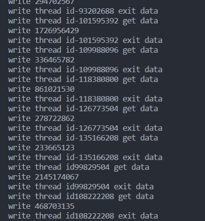

# **<center><font size=6>嵌入式软件开发技术与工具实验报告三</font></center>**

<center><font>黎炜桁</font></center>

---

### **一、实验目的**  

- 掌握基于pthread线程库的多线程编程技术。   
- 掌握基本的线程间同步技术(sem，mutex)。   
- 理解共享资源并掌握其操作方法。    

### **二、实验内容**  

1. 读者-写者问题多线程实现   
   - 一个数据集（如数据、文件等）被N个线程读写；   
   - 一些线程只要求读数据集内容，称为读者 (Reader)，实验读者数不少于6个；   
   - 另些线程要求修改数据集内容，称为写者 (Writer)，实验写者数不少于3个；   
   - 多个读者可以同时读数据集内容，不需要互斥操作；   
   - 一个写者不能和其他写者或读者同时访问数据集，换句话说，写者和其他写者或读者之间必须互斥操作！   
   - 读者优先：如果有读者，写者需要等待！用于更新不频繁或更新影响不显著、读者较多的场合；   
   - 写者优先：如果有写者，读者需要等待！用于更新频繁或更新影响显著的场合。   


### **三、实验过程与结果**  

#### 1. 读者优先   

   读者优先描述   
   如果读者来：   

   - 无读者、写着，新读者可以读；   
   - 无写者等待，但有其他读者正在读，新读者可以读；   
   - 有写者等待，但有其他读者正在读，新读者可以读；   
   - 有写者写，新读者等   
   如果写者来：   
   - 无读者，新写者可以写；   
   - 有读者，新写者等待；   
   - 有其他写者写或等待，新写者等待   

读者优先算法流程图如下


 - thread1.c   

   ```c
   #include "stdio.h"
   #include <stdlib.h>
   #include <pthread.h>
   #include<semaphore.h>
   
   
   #define N_WRITER 30 //写者数目
   #define N_READER 5 //读者数目
   #define W_SLEEP  1 //控制写频率
   #define R_SLEEP  1 //控制读频率
   
   
   pthread_t wid[N_WRITER],rid[N_READER];
   pthread_mutex_t mutex_write;//同一时间只能一个人写文件,互斥
   sem_t sem_read;//同一时间只能有一个人访问 readerCnt
   int data = 0;
   int readerCnt = 0;
   void write()
   {
       int rd = rand();
       printf("write %d\n",rd);
       data = rd;
   }
   void read()
   {
       printf("read %d\n",data);
   }
   void * writer(void * in)
   {
   
       pthread_mutex_lock(&mutex_write);
       printf("write thread id%d get data\n",pthread_self());
       write();
       printf("write thread id%d exit data\n",pthread_self());
       pthread_mutex_unlock(&mutex_write);
       sleep(W_SLEEP);
       pthread_exit((void *) 0);
   }
   
   void * reader (void * in)
   {
       sem_wait(&sem_read);
       readerCnt++;
       if(readerCnt == 1){
           pthread_mutex_lock(&mutex_write);
       }
       sem_post(&sem_read);
       printf("read thread id%d get data\n",pthread_self());
       read();
       printf("read thread id%d exit data\n",pthread_self());    
       sem_wait(&sem_read);
       readerCnt--;
       if(readerCnt == 0){
           pthread_mutex_unlock(&mutex_write);
       }
       sem_post(&sem_read);
       sleep(R_SLEEP);
       pthread_exit((void *) 0);
   }
   
   int main()
   {
       printf("read first\n");    
       pthread_mutex_init(&mutex_write,NULL);
       sem_init(&sem_read,0,1);
       int i = 0;
       for(i = 0; i < N_WRITER; i++)
       {
           pthread_create(&wid[i],NULL,writer,NULL);
       }
           for(i = 0; i < N_READER; i++)
       {
           pthread_create(&rid[i],NULL,reader,NULL);
       }
       sleep(1);
       return 0;
   }
   
   ```   

- 实验结果   

   编译文件   
   

   运行程序   

   
   
  

#### 2. 写者优先   

写者优先描述   
如果读者来：   

- 无读者、写者，新读者可以读；   
- 无写者等待，但有其他读者正在读，新读者可以读；   
- 有写者等待，但有其他读者正在读，新读者等；   
- 有写者写，新读者等   

如果写者来：   

- 无读者，新写者可以写；   
- 有读者，新写者等待；   
- 有其他写者或等待，新写者等待   

写者优先算法流程图如下   


- thread2.c

```c
   #include "stdio.h"
   #include <stdlib.h>
   #include <pthread.h>
   #include<semaphore.h>
   
    
   
   #define N_WRITER 5 //写者数目
   #define N_READER 20 //读者数目
   #define W_SLEEP 1 //控制写频率
   #define R_SLEEP  0.5 //控制读频率
   
   pthread_t wid[N_WRITER],rid[N_READER];
   int data = 0;
   int readerCnt = 0, writerCnt = 0;
   pthread_mutex_t sem_read;
   pthread_mutex_t sem_write;
   pthread_mutex_t mutex_write;
   pthread_mutex_t mutex_read;
    
   
   void write()
   {
       int rd = rand();
       printf("write %d\n",rd);
       data = rd;
   }
   void read()
   {
       printf("read %d\n",data);
   }
   void * writer(void * in)
   {
   
           sem_wait(&sem_write);
           {//临界区,希望修改 writerCnt,独占 writerCnt
               writerCnt++;
               if(writerCnt == 1){
                   //阻止后续的读者加入待读队列
                   pthread_mutex_lock(&mutex_read);
               }
           }
           sem_post(&sem_write);
           
           
           pthread_mutex_lock(&mutex_write);
           {//临界区，限制只有一个写者修改数据
               printf("write thread id%d get data\n",pthread_self());
               write();
               printf("write thread id%d exit data\n",pthread_self());        
           }
           pthread_mutex_unlock(&mutex_write);
           
           sem_wait(&sem_write);
           {//临界区,希望修改 writerCnt,独占 writerCnt
               writerCnt--;
               if(writerCnt == 0){
                   //阻止后续的读者加入待读队列
                   pthread_mutex_unlock(&mutex_read);
               }
           }
           sem_post(&sem_write);
           sleep(W_SLEEP);
       pthread_exit((void *) 0);
   }
    
   
   void * reader (void * in)
   {
           //假如写者锁定了mutex_read,那么成千上万的读者被锁在这里
               pthread_mutex_lock(&mutex_read);//只被一个读者占有
               {//临界区
                   sem_wait(&sem_read);//代码段 1
                   {//临界区
                       readerCnt++;
                       if(readerCnt == 1){
                           pthread_mutex_lock(&mutex_write);
                       }
                   }
                   sem_post(&sem_read);
               }
               pthread_mutex_unlock(&mutex_read);//释放时,写者将优先获得mutex_read
           printf("read thread id%d get data\n",pthread_self());
           read();
           printf("read thread id%d exit data\n",pthread_self());
           sem_wait(&sem_read);//代码段2
           {//临界区
               readerCnt--;
               if(readerCnt == 0){
                   pthread_mutex_unlock(&mutex_write);//在最后一个并发读者读 完这里开始禁止写者执行写操作
               }
           }
           sem_post(&sem_read);
           
           sleep(R_SLEEP);
       pthread_exit((void *) 0);
   }
    
   
   int main()
   {
       printf("write first\n");
       pthread_mutex_init(&mutex_write,NULL);
       pthread_mutex_init(&mutex_read,NULL);
       sem_init(&sem_write,0,1);
       sem_init(&sem_read,0,1);
   int i = 0;
       for(i = 0; i < N_READER; i++)
       {
           pthread_create(&rid[i],NULL,reader,NULL);
       }
       for(i = 0; i < N_WRITER; i++)
       {
           pthread_create(&wid[i],NULL,writer,NULL);
       }
       sleep(1);    
       return 0;
   }

```

- 实验结果   

   编译文件   
   

   运行程序   

   
   


### **四、实验总结**    

本次实验我利用课程中学到的pthread线程库中的多线程和信号量等相关函数，实现了读写者问题的读者优先和写者优先算法，加深了对多线程编程的理解。   
