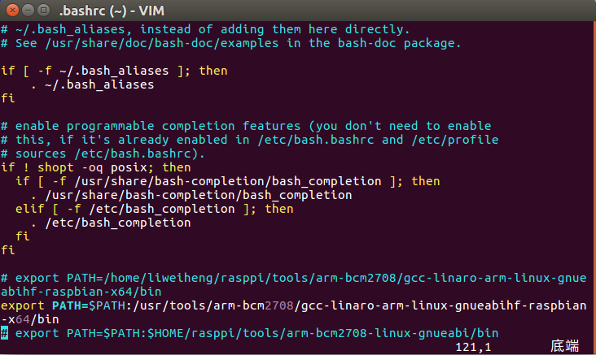
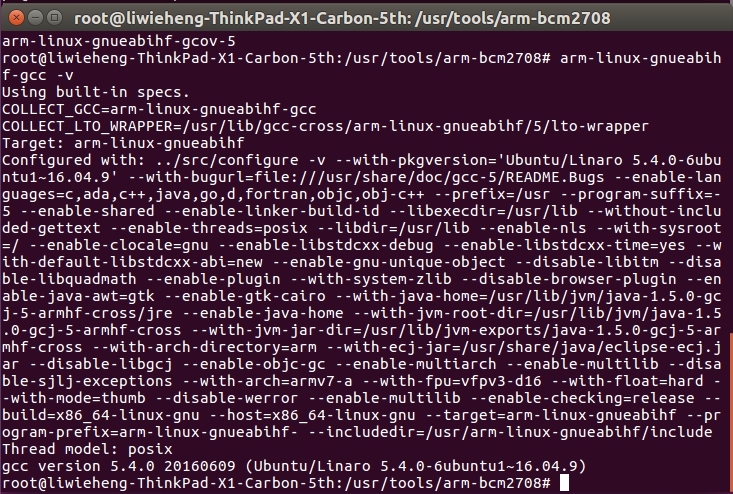
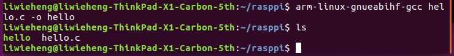
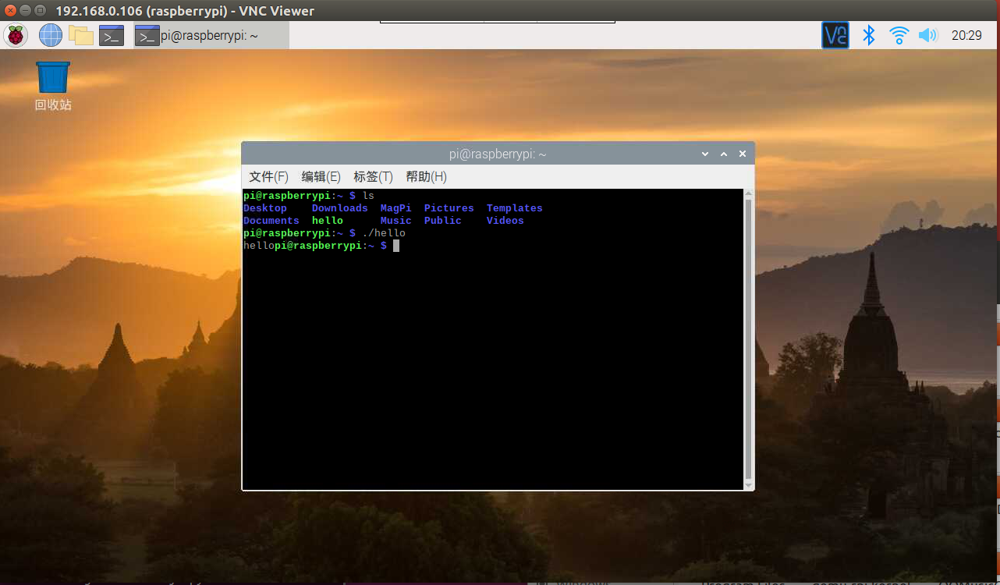
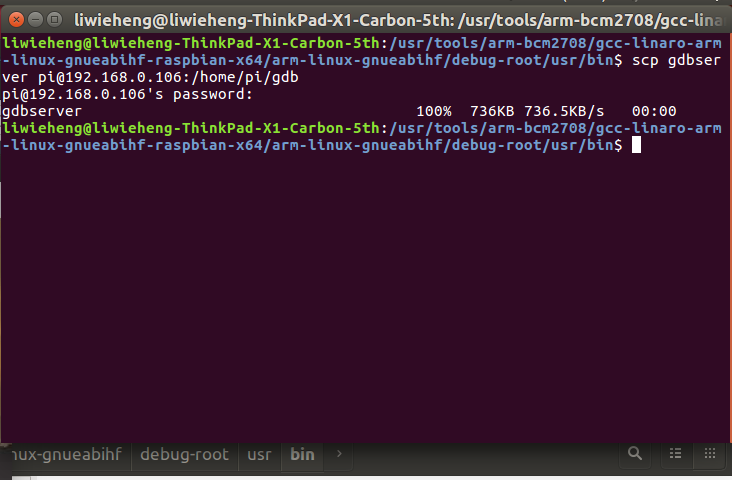
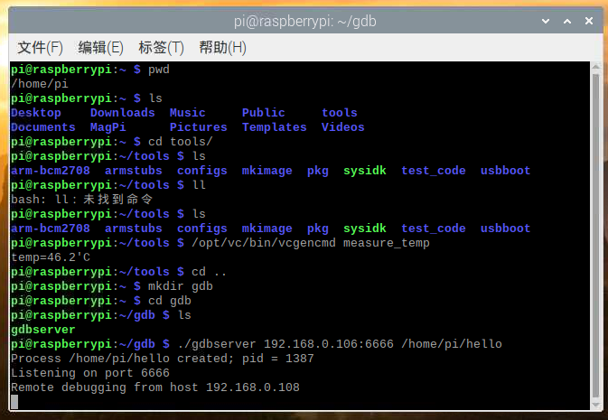
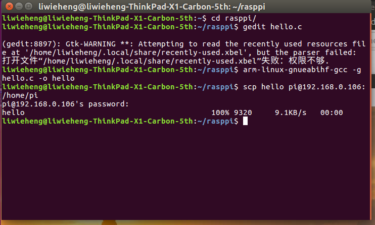
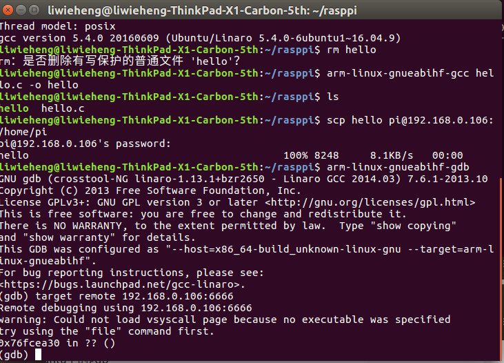
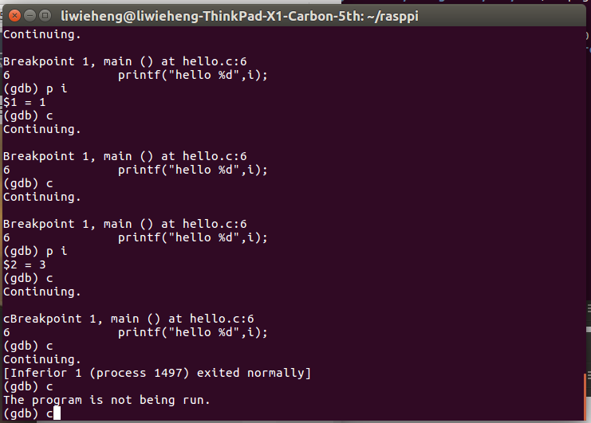
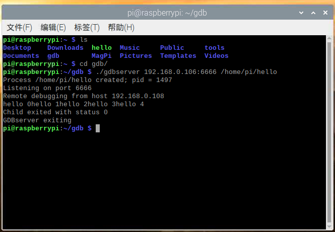

# **<center><font size=6>嵌入式软件开发技术与工具实验报告四</font></center>**

<center><font>黎炜桁</font></center>

---

### **一、实验目的**  

- 学会下载安装Linux及相关工具到目标机或目标机仿真环境。  
- 学会使用交叉编译器编译应用程序，并能够将可执行程序下载到目标机运行。  
- 学会使用交叉调试工具gdb-gdbserver调试应用程序。  

### **二、实验内容**  

1. Host-Target方案1：下载安装Linux系统到开发板，其中包括bootloader、内核、模块、库、文件系统等；建立host-target连接，常见连接有SSH，VNC，Putty。 
2. Host-Target方案2：下载安装目标机仿真环境qemu，安装qemu树莓派系统。 
3. 构建并测试开发板交叉编译器。  
4. 建立gdb-gdbserver交叉调试环境并能够调试应用程序。

### **三、实验过程与结果** 

#### 1. 下载安装Linux系统到开发板 


#### 2. 构建并测试开发板交叉编译环境   
- 下载交叉编译工具tools.git

- 将编译器路径加入到系统环境变量,并使用`source ~/.bashrc`应用设置。
 

- 输入`arm-linux-gnueabihf-gcc -v`查看交叉编译gcc版本，输出正确版本信息，表明交叉编译环境配置成功。
 

- 建立hello.c文件，验证交叉编译正确性
```c
    #include<stdio.h>

    int main(){
        printf("hello");
        return 0;
    }
```
- 使用交叉编译工具进行编译，获得输出文件hello
   
- 传输至树莓派运行，运行成功
   

- 总结
   交叉编译产生的执行文件不可在主机端运行，下载到目标端后运行成功，说明交叉编译工具是针对目标端环境进行编译的。

#### 3. 建立gdb-gdbserver交叉调试环境 

- 下载的交叉编译工具链中已包含了gdb-gdbserver相关工具，位于`tools/arm-bcm2708/gcc-linaro-arm-linux-gnueabihf-raspbian-x64/arm-linux-gnueabihf/debug-root/usr/bin
`目录下，可直接下载到树莓派目标端上即可使用


- 树莓派上启动gdbserver，打开6666端口作为调试使用


- 主机端Ubuntu使用-g关键字重新编译hello.c，支持gdb调试


- 主机端Ubuntu启动gdb，调试hello。使用`target remote`命令连接至目标端，`b 4`在第四行加入断点，`c`执行



- 在目标端树莓派gdbserver观察到程序执行成功


- 结论
   使用gdb-gdbserver进行远程调试可以非常方便的在主机端调试目标端程序，并可加入断点，观察变量等，极大的方便了程序的开发。
   需要注意的是在交叉编译时需要加入-g关键字使程序支持gdb调试，否则在gdb中进行调试将无法被识别。


### **四、实验总结**  

本次实验我掌握了在树莓派上安装了Linux系统，并实现了主机端与目标端的交叉编译、交叉调试环境，熟练了Linux下的编程。
