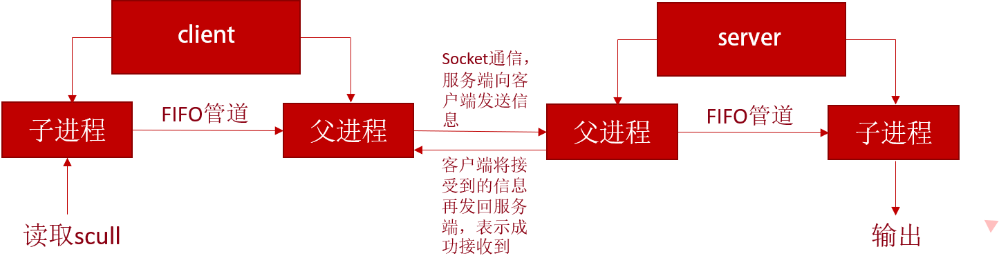
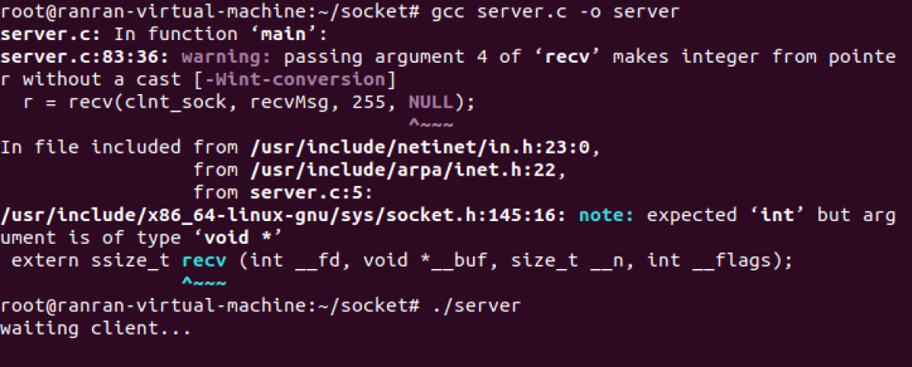
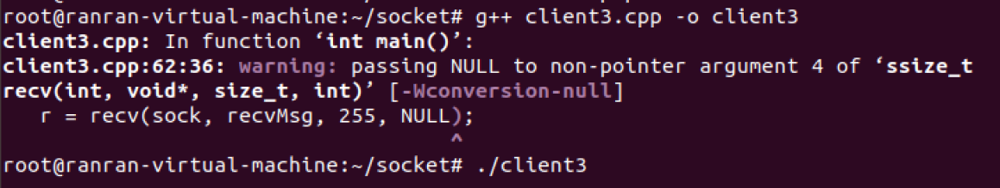
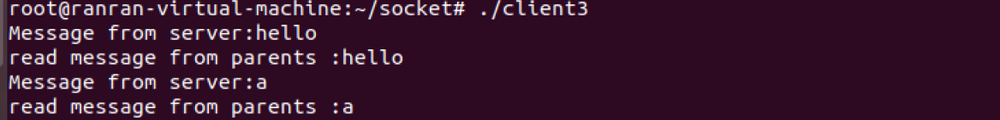
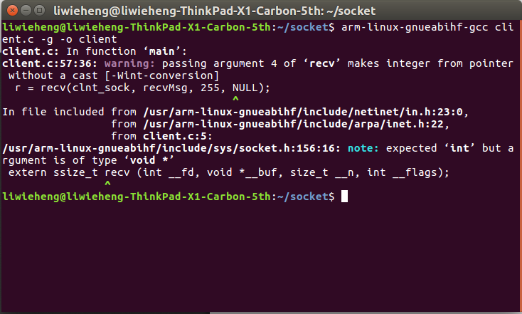
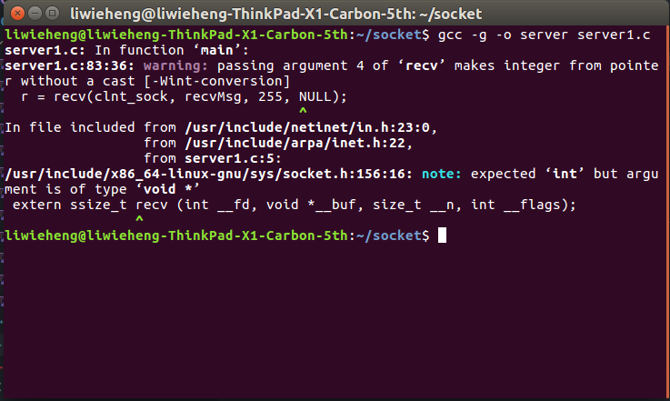
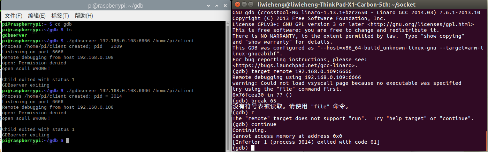
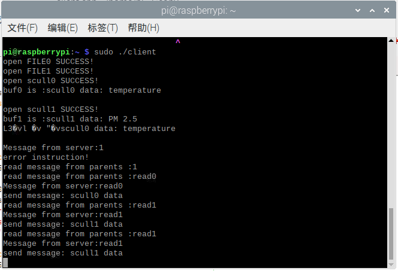
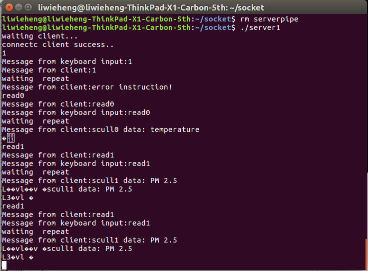

# **<center><font size=6>嵌入式软件开发技术与工具实验报告六</font></center>**

<center><font>黎炜桁 冉然 刘一丁</font></center>

---

### **一、实验目的**   

能够综合应用课程所学的技术与工具，包括：   

- Socket通信   
- 多进程、多线程编程   
- 交叉调试目标端程序   
- 磁盘分区与文件系统创建   
- 模块与驱动编程   

### **二、实验内容**   

1. 将树莓派设为智能家居Linux服务器，可用来采集并维护环境数据，如PM2.5、温度、湿度、气味、电器状态数据等。在实际环境中数据来自相应的传感器，本次试验中用scull设备模拟。有条件的小组鼓励使用真实设备采集数据。   
2. 要求创建2个以上的scull设备，设备驱动可选择从内核源码树外(Kbuild)编译安装，或加入到内核源码树内。驱动函数要求包括：open, release, read, write, llseek, ioctl。   
3. 实验中的环境数据存储在特定文件系统中。该文件系统要求具备属性：在线写入、持久性、断电可靠性。   
4. PC机、移动设备或另外一个树莓派用作远程客户端，随时请求获取环境数据，客户端和服务器之间采用Socket通信。   
5. APP编译采用交叉编译，用gdb-gdbserver交叉调试APP。   

### **三、实验过程与结果**   

#### **1. scull设备驱动**   

#### - scull设备创建   

   本实验创建两个scull设备，函数包括：open, release, read, write, llseek, ioctl，实现对数据的操作。   

   源代码分析：   

   - scull_open   

      ```c
      int scull_open(struct inode *inode, struct file *filp)
      {
       struct scull_dev *dev;
    
       dev = container_of(inode->i_cdev, struct scull_dev, cdev);
       filp->private_data = dev;
 
       if ((filp->f_flags & O_ACCMODE) == O_WRONLY)
       {
           if (down_interruptible(&dev->sem))
           {
               return -ERESTARTSYS;
           }
           scull_trim(dev);
           up(&dev->sem);
       }
      ```

      scull_open函数实现打开一个scull设备。应具有以下功能：1、检查设备特定的错误；2、如果设备是首次打开，则对其进行初始化；3、如有必要，更新f_op指针；4、分配并填写置于filp->private_data里的数据结构。container_of是在/linux/kernel.h中定义的宏，根据一个结构体变量中的一个域成员变量的指针来获取指向整个结构体变量的指针，此处获得我们自定义的scull结构体指针，并存入filp->private_data中。再调用scull_trim函数实现对所有内存空间的释放。   


   - scull_release     

      ```C
       int scull_release(struct inode *inode, struct file *filp)
      {
          return 0;
      }
      ```

      scull_release函数实现关闭设备，`return 0`即可。   


   - scull_read   

      ```C
      ssize_t scull_read(struct file *filp, char __user *buf, size_t count, loff_t *f_pos)
      {
          struct scull_dev *dev = filp->private_data;
          ssize_t retval = 0;
 
          if (down_interruptible(&dev->sem))
          {
              return -ERESTARTSYS;
          }
          if (*f_pos >= dev->size)
          {
              goto out;
          }
          if (*f_pos + count > dev->size)
          {
              count = dev->size - *f_pos;
          }
 
          if (!dev->data)
          {
              goto out;
          }
 
          if (raw_copy_to_user(buf, dev->data + *f_pos, count))
          {
              retval = -EFAULT;
              goto out;
          }
 
          *f_pos += count;
          retval = count;
       
          out:
              up(&dev->sem);
              return retval;
      }
      ```
 
      scull_read实现从设备中读取数据，调用`raw_copy_to_user`函数实现从内核空间到用户空间的拷贝，根据返回值判断读取情况。如果返回值等于传递给read系统调用的count参数，则说明所请求的字节数传输成功完成了。如果返回值是正的，但是比count小，则说明只有部分数据成功传送。如果返回值为0，则表示已经到达了文件尾。负值意味着发生了错误，该值指明了发生什么错误，错误码在<linux/errno.h>中定义。   

   - scull_write   

      ```C
      ssize_t scull_write(struct file *filp, const char __user *buf, size_t count, loff_t *f_pos)
      {
          struct scull_dev *dev = filp->private_data;
          ssize_t retval = -ENOMEM;
           
          if (down_interruptible(&dev->sem))   
          {
              return -ERESTARTSYS;
          }
 
          if (!dev->data)   
          {
              dev->data = kmalloc(SCULL_BUFFER_SIZE,GFP_KERNEL);
              if (!dev->data)
              {
                  goto out;
              }
              memset(dev->data, 0, SCULL_BUFFER_SIZE);
           }
 
          if (count > SCULL_BUFFER_SIZE - dev->size)
          {
              count = SCULL_BUFFER_SIZE - dev->size;
          }
 
          if (raw_copy_from_user(dev->data + dev->size, buf, count))
          {
              retval = -EFAULT;
              goto out;
          }
     
          dev->size += count;
          retval = count;
 
          out:
              up(&dev->sem);
              return retval;
       }
      ```

      scull_write实现向设备写入数据，调用`raw_copy_from_user`函数将数据从用户空间拷贝到内核空间，根据返回值判断写入的情况。如果返回值等于count，则完成了所请求数目的字节传送。如果返回值是正的，但小于count，则只传送了部分数据。程序很可能再次试图写入余下的数据。如果值为0，意味着什么也没有写入。负值意味着发生了错误。   

   - scull_ioctl   

      ```C
      long scull_ioctl(struct file *filp, unsigned int cmd, unsigned long arg)
      {
          struct scull_dev *dev = filp->private_data;
          int err = 0, retval = 0;

          if (_IOC_TYPE(cmd) != SCULL_IOC_MAGIC)
              return -ENOTTY;

          if (_IOC_NR(cmd) > SCULL_IOC_MAXNR)
              return -ENOTTY;

          if (_IOC_DIR(cmd) & _IOC_READ)
              err = !access_ok(VERIFY_WRITE, (void *)arg, _IOC_SIZE(cmd));
          else if (_IOC_DIRscull_(cmd) & _IOC_WRITE)
              err = !access_ok(VERIFY_READ, (void *)arg, _IOC_SIZE(cmd));
          if (err)
              return -EFAULT;

          switch (cmd) {
              case SCULL_IOC_CLEAR:
                  dev->data_i = 0;
                  printk(KERN_EMERG"SCULL_IOC_CLEAR data: 0\n");
                  break;
              case SCULL_IOC_GET:
                  retval = __put_user(dev->data_i, (int __user *)arg);
                  printk(KERN_EMERG"SCULL_IOC_GET data: %d\n", dev->data_i);
                  break;
              case SCULL_IOC_QUERY:
                 printk(KERN_EMERG"SCULL_IOC_QUERY data: %d\n", dev->data_i);
                  retval = dev->data_i;
                  break;
              case SCULL_IOC_SET:
                  retval = __get_user(dev->data_i, (int __user *)arg);
                  printk(KERN_EMERG"SCULL_IOC_SET data: %d\n", dev->data_i);
                  break;
              case SCULL_IOC_TELL:
                  dev->data_i = arg;
                  printk(KERN_EMERG"SCULL_IOC_TELL data: %d\n", arg);
                  break;
              default:
                  retval = -EINVAL;
                  break;
          }

          return retval;
      }
      ```   

      在驱动程序中，IO指令由4个部分组成：幻数scull_magic、序数number、位置direction、大小size，四部分组合可唯一确定一条指令，在头文件scull.h中定义。   

      scull_ioctl中定义了五条指令，分别是清除数据、通过指针从设备获得数据、通过返回值从设备获得数据、通过指针向设备写数据、通过参数向设备写数据，使用printk输出调试信息。   

   - scull_llseek   

      ```c
      loff_t scull_llseek(struct file *filp, loff_t off, int whence)
      {
          struct scull_dev *dev = filp->private_data;
          loff_t newpos;
       
          switch(whence)
          {
              case 0:
                  newpos = off;
                  break;
              case 1:
                  newpos = filp->f_pos + off;
                  break;
              case 2:
                  newpos = dev->size + off;
                  break;
              default:
                  return -EINVAL;
          }
          if (newpos < 0)
          {
              return -EINVAL;
          }
          filp->f_pos = newpos;
          return newpos;
      }
      ```   

      lseek的作用是重新定位读/写文件偏移量，whence共有三种取值与代码中一一对应：1.SEEK_SET，偏移量设置为offset字节；2.SEEK_CUR,偏移量设置为当前位置加上offset字节;3.SEEK_END,偏移量设置为文件大小加上偏移字节大小。成功完成后，lseek（）返回的结果是从文件开头的字节偏移位置。否则，返回-1并设置errno以指示错误。   

#### - scull设备安装   

   本实验共创建两个scull设备，分别为scull0，scull1。采用在内核源码树内编译的方式。   

   将`scull0.c scull0.h scull1.c scull1.h`复制到内核源码树`/linux/drivers/char/`目录下，修改该目录下的kconfig，加入两个设备   

      

   在kconfig选项中加入`default m`可以默认将两个scull设备作为模块编译，而不用在menuconfig中进行选择   

   再在该目录的makefile中加入编译选项   

      

   在linux源码根目录打开终端，使用`make ARCH=arm CROSS_COMPILE=arm-linux-gnueabihf- zImage modules`进行编译，即可在`/linux/drivers/char/`目录下得到`scull0.ko scull1.ko`两个驱动文件。   

      

   将文件传输到树莓派端   

      

   在树莓派端使用`sudo insmod`命令加载驱动，`lsmod`可观察到两个设备加载成功。   

      

   输入`cat /proc/devices`获得驱动的主设备号，并根据设备号使用`sudo mknod``创建驱动文件   

      

      

   scull设备在树莓派上加载成功。  

#### - scull设备测试   


   编写`test.c`文件对scull设备进行测试，主要测试其read、write、ioctl功能，test.c源码如下   

   ```c
   #include <stdio.h>
   #include <stdlib.h>
   #include <time.h>
   #include <unistd.h>
   #include <linux/i2c.h>
   #include <linux/fcntl.h>
   #include <linux/fs.h>
   #include <error.h>
   #include <sys/ioctl.h>
   
   #define SCULL_IOC_MAGIC '$'
   
   //定义命令->
   //数据清零
   #define SCULL_IOC_CLEAR _IO(SCULL_IOC_MAGIC, 0)
   //获取数据(通过指针)
   #define SCULL_IOC_GET   _IOR(SCULL_IOC_MAGIC, 1, int)
   //获取数据(通过返回值)
   #define SCULL_IOC_QUERY _IO(SCULL_IOC_MAGIC, 2)
   //设置数据(通过指针)
   #define SCULL_IOC_SET   _IOW(SCULL_IOC_MAGIC, 3, int)
   //设置数据(通过直接引用参数值)
   #define SCULL_IOC_TELL  _IO(SCULL_IOC_MAGIC, 4)
   
   
   int main()
   {
        int fd;
        int data;
        char buf[]="scull character device test by liweiheng";//写入   scull设备的内容
        char buf_read[4096]; //scull设备的内容读入到该buf中
    
        if((fd=open("/dev/scull1",O_RDWR)) < 0){
        //打开scull设备
            perror("open");
            printf("open scull WRONG！\n");
            exit(1);
        }
        else
            printf("open scull SUCCESS!\n");
     
        printf("buf is :%s\n",buf); 
        write(fd,buf,sizeof(buf)); //把buf中的内容写入scull设备
    
        lseek(fd,0,SEEK_SET); //把文件指针重新定位到文件开始的位置
     
        read(fd,buf_read,sizeof(buf)); //把scull设备中的内容读入到   buf_read中
    
        printf("buf_read is :%s\n",buf_read);
   
   //数据清零  
        ioctl(fd, SCULL_IOC_CLEAR);
   
   //直接传值测试
        data = ioctl(fd, SCULL_IOC_QUERY);
        data = 100;
        ioctl(fd, SCULL_IOC_TELL, data);
   
   //指针传值测试
        ioctl(fd, SCULL_IOC_GET, &data);
        data = 122;
        ioctl(fd, SCULL_IOC_SET, &data);
    
   
    return 0;
    }
   ```   

   编译后运行./test，成功输出结果，左侧终端使用`sudo cat /proc/kmsg`用于观察printk输出的调试信息，右侧终端观察正常调试信息，可见read、write、ioctl功能正常，设备测试成功。   

      

#### - 总结   
   scull设备是一种学习linux驱动编写的工具，通过编写scull驱动，加深了对linux运行机制的认识，在驱动编写的过程中也遇到过一些问题，例如：   

   1. `copy_to_user`，`copy_from_user`在新版linux内核中已不再使用，需要修改为`raw_copy_from_user`，`raw_copy_to_user`才能成功编译。   
   2. 在linux内核源码树外编译scull遇到了无法找到头文件的问题，多次尝试后不能解决，尝试在内核源码树内编译成功，在kconfig选项中加入default m可以默认将两个scull设备作为模块编译，而不用在menuconfig中进行选择，相对更加方便。   
   3. printk无法在终端显示，需要打开一个新的终端，使用`sudo cat /proc/kmsg`才能观察printk的调试输出。   


#### 2. 构建服务端、客户端程序 

   - 程序框架   

         

   - socket通信   

       客户端   
 
       ```C
       //客户端client   
       int sock = socket(AF_INET, SOCK_STREAM, 0);
       //向服务器（特定的IP和端口）发起请求
       struct sockaddr_in serv_addr;
       memset(&serv_addr, 0, sizeof(serv_addr));  //每个字节都用0填充
       serv_addr.sin_family = AF_INET;  //使用IPv4地址
       serv_addr.sin_addr.s_addr = inet_addr("192.168.0.108");  //具体的IP地址
       serv_addr.sin_port = htons(1234);  //端口
       connect(sock, (struct sockaddr*)&serv_addr, sizeof(serv_addr));
       ```

       服务端   

       ```C   
       //服务端server
       //创建套接字
       int serv_sock = socket(AF_INET, SOCK_STREAM, IPPROTO_TCP);
       //将套接字和IP、端口绑定
       struct sockaddr_in serv_addr;
       memset(&serv_addr, 0, sizeof(serv_addr));  //每个字节都用0填充
       serv_addr.sin_family = AF_INET;  //使用IPv4地址
       serv_addr.sin_addr.s_addr = htonl(INADDR_ANY);
       serv_addr.sin_port = htons(1234);  //端口
       bind(serv_sock, (struct sockaddr*)&serv_addr, sizeof(serv_addr));
       //进入监听状态，等待用户发起请求
       listen(serv_sock, 20);
       printf("waiting client...\n");
       //接收客户端请求
       struct sockaddr_in clnt_addr;
       socklen_t clnt_addr_size = sizeof(clnt_addr);
       int clnt_sock = accept(serv_sock, (struct sockaddr*)&clnt_addr, &    clnt_addr_size);
       if(-1==clnt_sock){
   	    printf("error\n");
   	    return 2;
       }
       printf("connectc client success..\n");nfig
       ```   
   
       socket通信部分实现局域网下两设备的网络连接，通过端口1234传递信息。
   
   - 父进程与子进程FIFO通信   

      客户端   

      ```C
      //父进程
      client1fd = open("client1pipe",O_WRONLY,0);//向子进程发送信息
      while(1)
      {
          char recvMsg[100] = {0};
          int r;
      		r = recv(sock, recvMsg, 255, NULL);
      		if (r > 0) {
                //fifo
                write(client1fd,recvMsg,strlen(recvMsg)+1);
      			printf("Message from server:%s\n", recvMsg);			
      		}

      write(sock, recvMsg, strlen(recvMsg));//将接收到的数据返回服务端,表示成功接收到
       
      //子进程
      buf[100] = {0};
      readfd = open("client1pipe",O_RDONLY,0);
      read(readfd,buf,100);
      close(readfd);
      printf("read message from parents :%s\n", buf);
      ```   

      服务端   

      ```C   
      //父进程   
      readfd = open("serverpipe",O_RDONLY,0);
      read(readfd,buf,100);
      //printf("Message from server:%s\n", buf);
      write(clnt_sock, buf, strlen(buf)+1);
   
      printf("waiting  repeat\n");
   
      int r;
      char recvMsg[100] = {0};
   	  r = recv(clnt_sock, recvMsg, 255, NULL);
   	  if (r > 0) {
   	      printf("Message from client:%s\n", recvMsg);
      }
   
      //子进程
      writefd = open("serverpipe",O_WRONLY,0);
      char str[100] = {0};   //keyboard input
      //scanf("%s",str);
   
      fgets(str,100,stdin);
      str[strlen(str)-1]='\0';
      write(writefd,str,strlen(str)+1);
   	  printf("Message from keyboard input:%s\n", str);
      ```   

      在父子进程的FIFO通信中,先用open()函数打开管道,再在一进程中使用write函数写入,在另一进程中read函数读出。

   - 测试

      分别进行编译:   

      server.c编译并运行   

         

      client.cpp编译并运行   

           
   
      显示socket连接成功:   

         

      服务端子进程接收键盘输入数据hello和a,成功收到了客户端返回的确认信息。   

      

      观察客户端输出,父进程从服务端成功接收到了hello和a,并成功发送给子进程输出。   

         
  
   - 总结

      在实验的过程中也遇到过一些问题，例如：

      1. 对strlen函数的理解出现了偏差,strlen函数求字符串的长度并不包括/0,所以srtlen求出的长度还要加1,否则输出会错误。   

 #### 3. 综合应用实验   

   - 整体框架设计   

      在树莓派上安装两个scull设备scull0和scull1，分别模拟PM2.5和温度信息，将两条信息分别保存在ext3文件系统的`/mnt/user1`和`/mnt/user2`两个目录下实现数据的可靠存储。再将信息写入到scull设备中，根据主机端发送的不同指令，传输scull设备中的数据到主机端。

      主机端与树莓派间通过socket建立可靠通信，主机端可向树莓派发送命令请求scull中的数据，主机端输入`read0`是请求scull0设备中的信息，主机端输入`read1`则是请求scull1设备中的信息，若输入其他字符则会返回错误。

      树莓派端建立一个子进程打印从主机端接收到的指令，主进程根据收到指令读取对应scull设备中的信息发送给主机端。主机端建立一个子进程接收从键盘输入的指令并发送给主进程，主进程将输入的指令发送到树莓派端，接收并输出树莓派端返回的数据，两进程间采用fifo管道进行通信。
 
   - 实验代码   

      在上文客户端程序的基础上，添加对scull设备的读写支持及接收相关命令后的操作，完成整个工程的组建。   

      - 在client.c中打开两个scull设备和存放数据的文件，将文件中数据写入scull设备   

         ```C
         int fd_file0,fd_file1,fd_scull0,fd_scull1;
         int data;
         char buf0[30];//写入scull设备的内容
         char buf1[30];
         char buf_read0[4096]; //scull设备的内容读入到该buf中
         char buf_read1[4096];
        
         if((fd_file0 = open("/mnt/user1/scull0data",O_RDWR | O_CREAT,      S_IRUSR | S_IWUSR))<0){
             perror("open");
             printf("open FILE0 WRONG！\n");
             exit(1);
         }
         else
           printf("open FILE0 SUCCESS!\n");
         
         if((fd_file1 = open("/mnt/user2/scull1data",O_RDWR | O_CREAT,      S_IRUSR | S_IWUSR))<0){
             perror("open");
             printf("open FILE1 WRONG！\n");
             exit(1);
         }
         else
             printf("open FILE1 SUCCESS!\n");
         
         read(fd_file0, buf0, 30);
         
         read(fd_file1, buf1, 30);
         
         if((fd_scull0 = open("/dev/scull0",O_RDWR))<0){
         //打开scull0设备
             perror("open");
             printf("open scull0 WRONG！\n");
             exit(1);
         }
         else
             printf("open scull0 SUCCESS!\n");
     
         
         if(write(fd_scull0,buf0,sizeof(buf0) ) == 0)
             printf("write failed!\n");
         
         printf("buf0 is :%s\n",buf0); 
     
         if((fd_scull1 = open("/dev/scull1",O_RDWR))<0){
         //打开scull1设备
             perror("open");
             printf("open scull1 WRONG！\n");
             exit(1);
         }
         else
             printf("open scull1 SUCCESS!\n");
     
         
         if(write(fd_scull1,buf1,sizeof(buf1) ) == 0)
             printf("write failed!\n");
         
         printf("buf1 is :%s\n",buf1); 
         ```   

      - 根据接收到的指令做出回应，若recvMsg接收到的为`read0`，则将scull0设备中存储的数据读出，通过socket管道传输到主机端；若recvMsg接收到的为`read1`，则将scull1设备中存储的数据读出，通过socket管道传输到主机端；其他情况下则返回一条`error instruction`信息   

         ```c
         if(recvMsg[0] == 'r' && recvMsg[1] == 'e' && recvMsg[2] == 'a' && recvMsg[3] == 'd' && recvMsg[4] == '0'){//读取scull0中的数据

            printf("send message: scull0 data\n");
            lseek(fd_scull0,0,SEEK_SET); //把文件指针重新定位到文件开始的位置
   
            read(fd_scull0,buf_read0,strlen(buf0)); //把scull设备中的内容读入到buf_read中
            write(sock, buf_read0, strlen(buf_read0));
            //recvMsg = "scull control";
            //write(sock, recvMsg, strlen(recvMsg));
         }else if(recvMsg[0] == 'r' && recvMsg[1] == 'e' && recvMsg[2] == 'a' && recvMsg[3] == 'd' && recvMsg[4] == '1'){//读取scull1中的数据

            printf("send message: scull1 data\n");
            lseek(fd_scull1,0,SEEK_SET); //把文件指针重新定位到文件开始的位置
   
            read(fd_scull1,buf_read1,strlen(buf1)); //把scull设备中的内容读入到buf_read中
            write(sock, buf_read1, strlen(buf_read1));
            //recvMsg = "scull control";
            //write(sock, recvMsg, strlen(recvMsg));
         }else{//非读取指令，返回错误
            printf("error instruction!\n");
            char error[] = "error instruction!";
            write(sock, error, strlen(error));
         ```


   - 实验过程   

      在主机端交叉编译树莓派端程序client   

         

      主机端采用gcc编译server，加入-g选项以备调试   
   
         

      在开发过程中进行GDB远程调试，GDB所提供的断点和单步调试功能极大地方便了开发   

          

       最终运行整个系统，首先在主机端运行`./server`，再在树莓派端运行`sudo ./client`，树莓派端需要sudo来访问驱动文件   

          
       
          

       因为没有真实传感器采集数据，实验中在scull设备中存入字符串`scull0 data:temperature`、`scull1 data: PM2.5`模拟对传感器采集数值的读写操作，主机端采用`read0`、`read1`命令读取两个scull设备中的值。实验中分别读取了两个设备中的数据，若输入除两个命令以外的数据，则树莓派端不会返回scull的数据，返回`error instruction!`。   


### **四、实验总结**   

   在本次综合实验中，我们小组综合运用了整个学期中所学到的知识，如文件系统、多进程编程、交叉编译、远程调试、驱动编写、socket、fifo管道等，在此基础上完成了整个系统的搭建，实现了从主机端向树莓派挂载的设备请求数据的功能，加深了对嵌入式开发的理解。   


